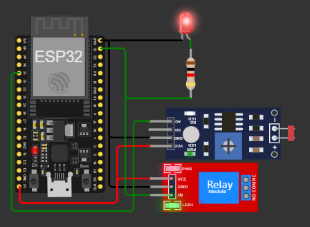
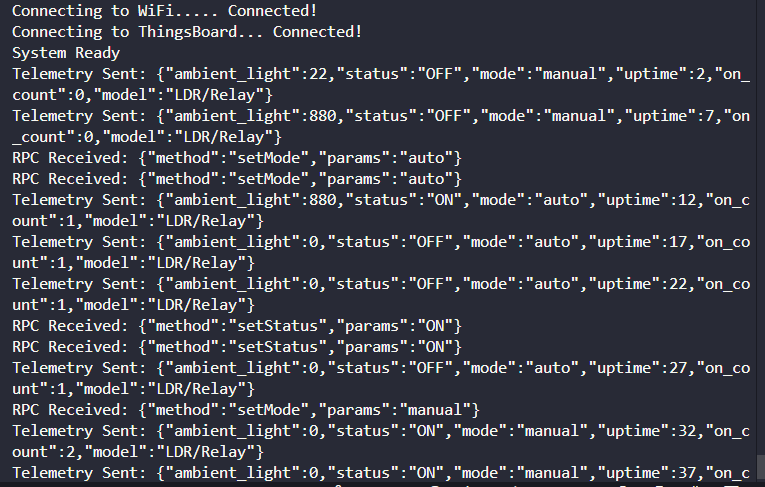
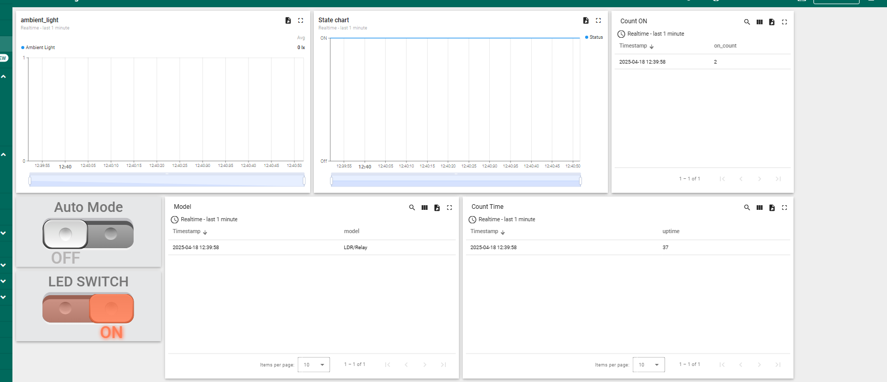

# Streetlight-Dashboard-Monitoring_ESP32
---
A real-time **smart streetlight monitoring system** built using **ESP32**, **LDR**, **relay**, and **ThingsBoard Cloud**. This project visualizes streetlight operation, ambient light data, system uptime, and more on an interactive dashboard.

---

## 📸 System Overview

| Component           | Description                         |
|---------------------|-------------------------------------|
| ESP32               | Main microcontroller                |
| LDR Sensor          | Measures ambient brightness         |
| Relay Module        | Controls the streetlight            |
| ThingsBoard         | Cloud IoT platform for visualization|
| Wi-Fi               | Used to connect ESP32 to internet   |

---

## 🔧 Features

✅ Real-time telemetry updates every 0.5 seconds  
✅ Remote control via ThingsBoard RPC: switch modes and toggle light  
✅ Uptime tracking since device boot  
✅ Count how many times the light has been turned ON  
✅ Auto/Manual mode switching  
✅ Dashboard widgets showing telemetry and attributes  

---

## 🧠 Telemetry Data Structure

Data sent to ThingsBoard:

```json
{
  "ambient_light": 120,
  "status": "ON",
  "uptime": 45600,
  "mode": "AUTO",
  "on_count": 5,
  "model": "ESP32-Relay-LDR"
}
```


---

## 🖥️ Dashboard View

An interactive dashboard was created on [ThingsBoard Cloud](https://thingsboard.cloud) with the following widgets:

| Widget              | Description                          |
|---------------------|--------------------------------------|
| Gauge               | Ambient Light Level (0–1023)         |
| Switch              | Light Status (ON/OFF)                |
| LED Indicator       | Mode (Auto/Manual)                   |
| Digital Display     | Uptime (seconds)                     |
| Counter             | Number of times light turned ON      |
| Label Card          | Device Model                         |

---

## 📶 Circuit Diagram

> 📷 **Replace the image URL with your actual diagram or upload to your repo**



---

## 📟 Terminal Output

> 📷 **Replace this with an actual screenshot of the terminal log**



---

## 📊 ThingsBoard Dashboard Example

> 📷 **Replace this with an actual screenshot of your dashboard**



---

## 🧩 MQTT Configuration

- **MQTT Server:** `thingsboard.cloud`  
- **Port:** `1883`  
- **Device Access Token:** (get from ThingsBoard device credentials)
